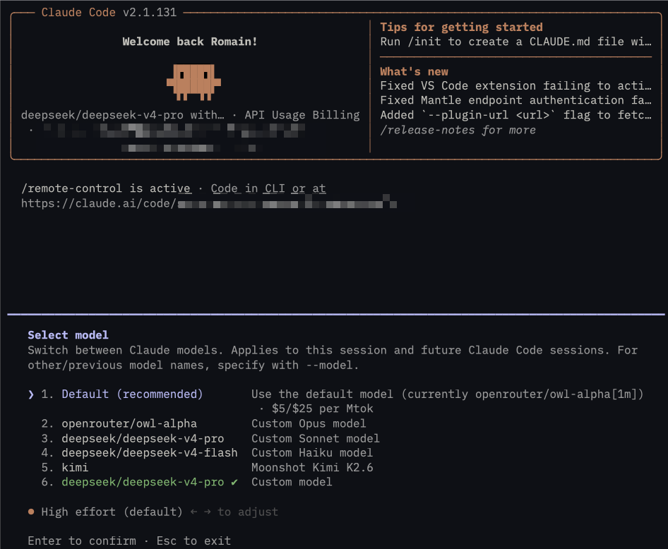

# lcc — Launch Claude Code

[](./LICENSE)
[](https://github.com/eRom/launch-ccode-cli/releases)
[](https://www.rust-lang.org)
[](https://github.com/eRom/launch-ccode-cli/stargazers)

A lightweight Rust launcher that lets you run the official **Claude Code** CLI
against any OpenAI/Anthropic-compatible provider — OpenRouter, Ollama, vLLM,
LiteLLM, your own gateway — without juggling environment variables by hand.



```bash
lcc start --profil openrouter
```

## Why

Claude Code reads its provider configuration from environment variables
(`ANTHROPIC_BASE_URL`, `ANTHROPIC_AUTH_TOKEN`, `ANTHROPIC_MODEL`, …). Editing
your shell rc file every time you want to swap from Claude → OpenRouter →
local Ollama is painful. `lcc` keeps named **profiles** in a single JSON file
and injects the right env vars per launch.

A single profile can also hold **multiple models** behind one provider, so
once you're inside Claude Code, the built-in `/model` command lets you switch
models on the fly without restarting the session.

## Install

Requires Rust 1.85+ (edition 2024) and the official `claude` CLI installed
([Claude Code docs](https://docs.claude.com/en/docs/claude-code/overview)).

```bash
git clone https://github.com/eRom/launch-ccode-cli.git
cd launch-ccode-cli
cargo install --path .
```

Then create your config at `~/.config/launch-claude-code/settings.json` —
see [`config-sample.json`](./config-sample.json) for a starting point.

## Quick start — single-model profile

Map one model to one provider. Simplest form:

```json
{
  "profiles": {
    "ollama-local": {
      "model": "gemma4",
      "base_url": "http://localhost:11434/v1",
      "api_key": "",
      "auth_token": "ollama"
    }
  }
}
```

```bash
lcc start --profil ollama-local
```

`${VAR}` placeholders in any string field are expanded from your shell
environment at launch time, so secrets never live in the file:

```json
"auth_token": "${OPENROUTER_API_KEY}"
```

## Multi-model profile — `/model` switching at runtime

When you have one provider and several models behind it (typical OpenRouter
setup), declare them all under one profile:

```json
{
  "profiles": {
    "openrouter": {
      "base_url": "https://openrouter.ai/api",
      "auth_token": "${OPENROUTER_API_KEY}",
      "default": "deepseek-v4-pro",
      "models": {
        "owl-alpha":         { "id": "openrouter/owl-alpha",        "slot": "opus" },
        "deepseek-v4-pro":   { "id": "deepseek/deepseek-v4-pro",    "slot": "sonnet" },
        "deepseek-v4-flash": { "id": "deepseek/deepseek-v4-flash",  "slot": "haiku" },
        "kimi":              { "id": "moonshotai/kimi-k2.6", "slot": "custom",
                               "description": "Moonshot Kimi K2.6" },
        "gemma-4-26b":       { "id": "google/gemma-4-26b-a4b-it" },
        "glm-5.1":           { "id": "z-ai/glm-5.1" }
      }
    }
  }
}
```

Each `slot` maps to a Claude Code env var so the model appears in the
interactive `/model` picker:

| `slot`    | Env var                            | `/model` behaviour                |
|-----------|------------------------------------|-----------------------------------|
| `opus`    | `ANTHROPIC_DEFAULT_OPUS_MODEL`     | `/model opus` switches instantly  |
| `sonnet`  | `ANTHROPIC_DEFAULT_SONNET_MODEL`   | `/model sonnet` switches instantly|
| `haiku`   | `ANTHROPIC_DEFAULT_HAIKU_MODEL`    | `/model haiku` switches instantly |
| `custom`  | `ANTHROPIC_CUSTOM_MODEL_OPTION` (+ `_NAME` / `_DESCRIPTION`) | adds an extra entry to the picker |
| *(none)*  | —                                  | reachable via full slug: `/model google/gemma-4-26b-a4b-it` |

Only one model can claim `slot: "custom"`. Models without a slot still work
— Claude Code accepts any arbitrary model id at the `/model` prompt and
validates it through a small probe call.

```bash
lcc start --profil openrouter
# inside Claude Code:
#   /model            → opens the picker
#   /model opus       → switches to owl-alpha
#   /model haiku      → switches to deepseek-v4-flash
#   /model z-ai/glm-5.1
```

## CLI

```
lcc list                            # show configured profiles
lcc settings                        # open the JSON file in your editor
lcc settings --validate             # parse-check the JSON
lcc start --profil <name> [args…]   # launch claude with the given profile
```

Anything after `--profil <name>` is passed straight through to `claude`, so
you can override the model at launch time or use any native flag:

```bash
lcc start --profil openrouter --model moonshotai/kimi-k2.6
lcc start --profil openrouter -- --output-format json -p "hello"
```

## Settings reference

`~/.config/launch-claude-code/settings.json`:

```jsonc
{
  "profiles": {
    "<name>": {
      // === Single-model profile ===
      "model":       "<model id>",
      "base_url":    "<provider URL>",
      "api_key":     "<key or ${ENV}>",     // wins if non-empty
      "auth_token":  "<token or ${ENV}>",   // used if api_key is empty
      "env":         { "EXTRA_VAR": "value" }   // optional, passed to claude

      // === OR Multi-model profile ===
      "base_url":    "<provider URL>",
      "auth_token":  "${ENV}",
      "default":     "<key in models>",
      "models": {
        "<friendly name>": {
          "id":          "<model id>",
          "slot":        "opus" | "sonnet" | "haiku" | "custom",  // optional
          "description": "<shown in custom picker>"               // optional
        }
      },
      "env": { "EXTRA_VAR": "value" }   // optional
    }
  }
}
```

Authentication: if both `api_key` and `auth_token` are set, the API key wins
(set as `ANTHROPIC_API_KEY`). Empty `api_key` falls back to `auth_token`
(set as `ANTHROPIC_AUTH_TOKEN`). At least one must be non-empty.

## Known limitations

- Claude Code's non-interactive **print mode** (`-p`) parses the model's
  response with a strict extractor that expects an Anthropic-native content
  shape. Some non-Anthropic models served via OpenAI-compat gateways return
  blocks the extractor doesn't surface, leaving `result` empty even though
  the model billed tokens. Interactive mode works fine for those models.
  This is a Claude Code ↔ provider compatibility issue, not an `lcc` issue.

## License

MIT — see [LICENSE](./LICENSE).
